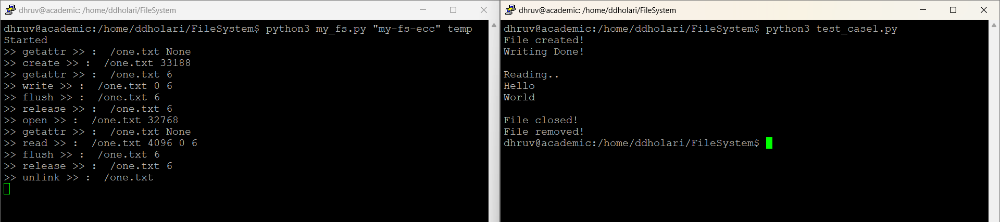
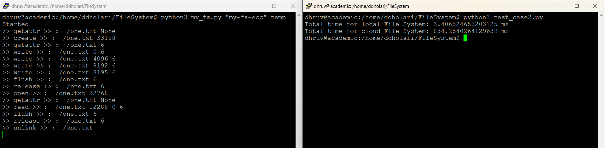
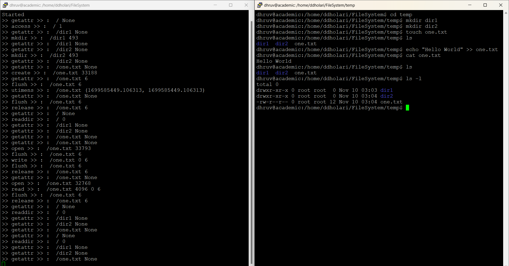
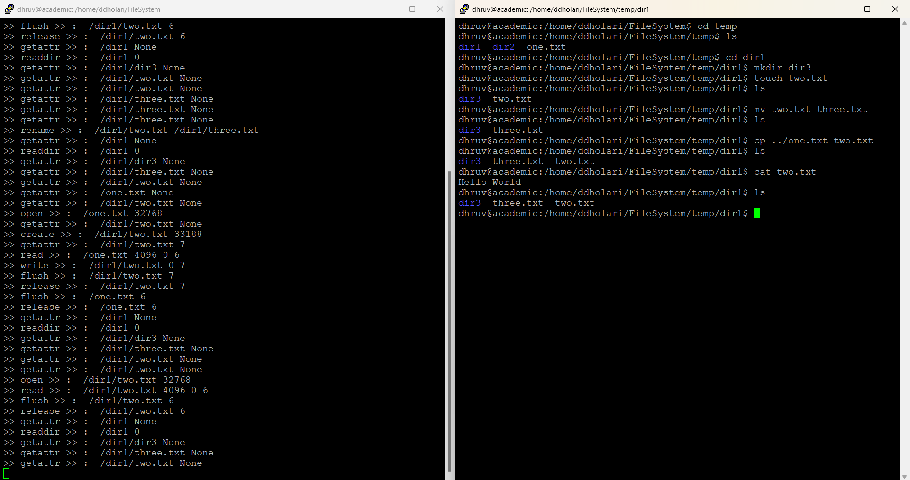
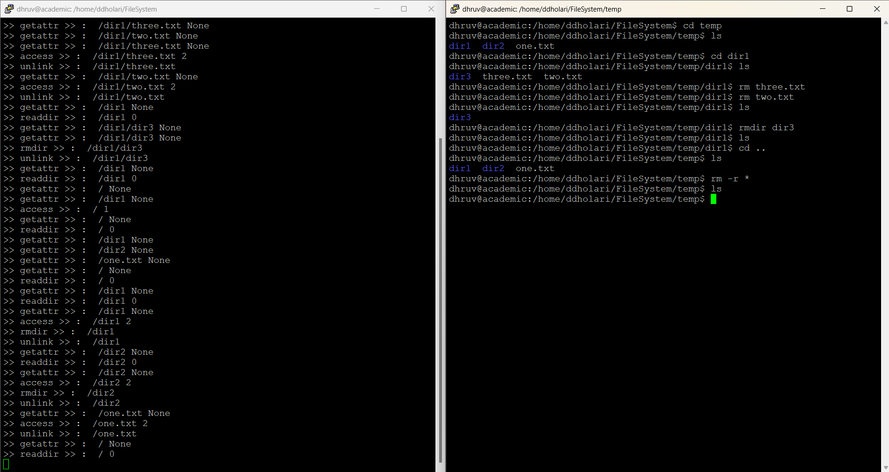

# CloudStorageFileSystem

## Introduction

CloudStorageFileSystem is a project aimed at designing and implementing a file system that utilizes cloud object storage. Traditional file systems are typically implemented within the operating system kernel, but this project explores the possibility of implementing a file system in user space using the FUSE (Filesystem in Userspace) interface.

The core components of CloudStorageFileSystem consist of:

1. **FUSE Interface:** FUSE, which stands for Filesystem in Userspace, allows for the creation of file systems without the need to modify the operating system kernel. ```When a directory is mounted using FUSE, the kernel forwards file system calls to a user-space FUSE handler. This project utilizes fusepy, a Python module.``` This module is just a simple interface to FUSE that simplifies the implementation of user-space file systems.This approach allows for flexibility and ease of development as file system operations can be handled by user-level programs.

2. **Cloud Storage:** ```CloudStorageFileSystem intercepts file system operations and invokes corresponding cloud storage APIs to perform actions such as reading from and writing to objects in the cloud storage service. The project leverages cloud object storage services Google Cloud Storage.``` These services provide scalable, durable, and highly available storage for storing files as objects. It is crucial to handle consistency and error cases carefully, to prevent data loss and ensure the reliability of the file system.

## Design Details

### File System Operations

The CloudStorageFileSystem project implements a subset of file system operations to interact with files and directories. These operations include:

- **Mount:** Mounts the file system, establishing a connection between the user-space FUSE handler and the cloud object storage.
  
- **Create:** Creates a new file in the cloud storage.
  
- **Open:** Opens an existing file for reading or writing.
  
- **Read:** Reads data from a file stored in the cloud storage.
  
- **Write:** Writes data to a file stored in the cloud storage.
  
- **Close:** Closes an open file.

Additional file system operations related to directory management are also implemented, such as:

- **mkdir:** Creates a new directory in the cloud storage.
  
- **opendir:** Opens an existing directory.
  
- **readdir:** Reads the contents of a directory.
  
- **rmdir:** Removes an empty directory from the cloud storage.

### File Read/Write Operations

Before reading and writing operations, the CloudStorageFileSystem temporarily stores files in a local temporary directory. Once the operation is finished, it seamlessly transfers the file to cloud storage, followed by the deletion of the local temporary directory.


### Extensibility

The design of CloudStorageFileSystem allows for easy extensibility to support additional file system operations or integrate with different cloud storage providers. The architecture facilitates the addition of new features.

## Running the Script

To run the my_fs.py script, follow these steps:

1. Install the required dependencies:
    ```
    pip install fusepy
    pip install --upgrade google-cloud-storage
    ```

2. Run the script using Python:
    ```
    python my_fs.py "credentials_file" "bucket_name" "folder_path"
    ```
    - **credentials_file:** This parameter specifies the path to the credentials file (credentials.json) used for authentication. Obtain a credentials.json file for a specific Google Cloud service account. Replace 'credentials_file' with the actual path to your credentials.json file.
    - **bucket_name:** Create a bucket instance on Google Cloud Storage and provide the bucket name as the parameter.
    - **folder_path:** Specify the path of the folder where script will mount the cloud storage bucket.

3. Once the script is running, open a new terminal window and navigate to the specified 'folder_path'.

4. Perform file system commands to interact with the cloud storage.

5. To exit, press Ctrl + C.

## Demo

In all screenshots, the left side of the terminal displays the file system functions called from the script, while the right side of the terminal showcases the file system operations performed at the temporary directory where cloud storage is mounted.

### Testcase 1
Output of test_case1.py, which creates a file, writes "Hello\nWorld\n" to it, reads the content, and then closes and deletes the file.



### Testcase 2
Output of test_case2.py, a Python script comparing the time taken by the local file system with the implemented cloud storage file system. The script writes 1000 lines to a file and then reads the data. Operations on the local file system took 3.4 ms, while on the cloud storage, it took 834.3 ms.



### File System Operations

- Below screenshot demonstrates file system commands: mkdir, touch, echo (write), cat, ls



- Below screenshot demonstrates file system commands: cd, cp, mv



- Below screenshot demonstrates file system commands: rm, rmdir, rm -r




## References

- https://thepythoncorner.com/posts/2017-02-27-writing-a-fuse-filesystem-in-python/ 
- https://cloud.google.com/storage/docs/introduction


